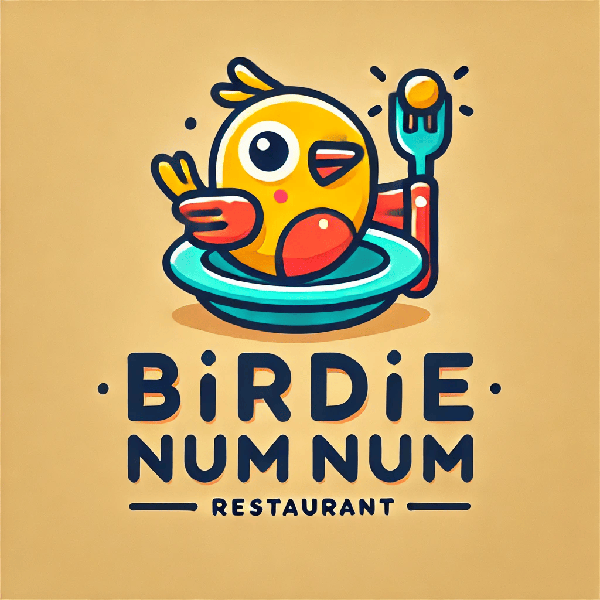

 Food Order App  
=========
## Birdie Num Num  

Birdie Num Num is a modern food ordering app designed to make ordering food seamless and enjoyable for customers and efficient for admins. Built with purpose, our app ensures the most delicious food is ready at a moment’s notice while providing powerful tools for managing orders and inventory.

## Key Features

- Seamless Order Processing: Customers can place orders easily, while admins receive instant notifications.
- Real-Time Notifications: Customers are kept informed via SMS—whether their order is approved, rejected, or ready for pickup.
- Order Analytics: Easily search orders by customer or dish to gain insights into trends and preferences.
- Inventory Management: Track stock levels to ensure items are available and orders are fulfilled.

## Technologies Used
- Front-End: HTML, CSS, JavaScript (jQuery, Bootstrap)
- Back-End: Node.js, Express.js
- Database: PostgreSQL
- SMS Integration: Twilio API

### Landing Page

## Dependencies
The app uses the following dependencies:

- body-parser: ^1.20.3
- chalk: ^2.4.2
- cookie-session: ^2.1.0
- dotenv: ^2.0.0
- ejs: ^2.6.2
- express: ^4.21.2
- morgan: ^1.9.1
- pg: ^8.13.1
- twilio: ^5.4.0
